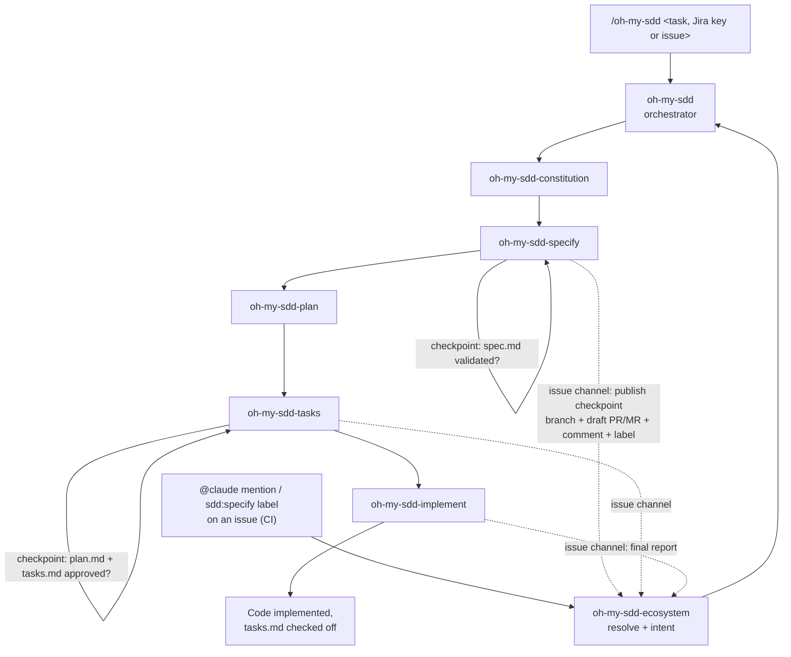

# Architecture Overview

`oh-my-sdd` is not one monolithic skill — it's an **orchestrator** that activates **5 specialized skills**, one per phase of Spec-Driven Development, plus a **channel adapter** (`oh-my-sdd-ecosystem`) that lets the same pipeline run from a GitHub/GitLab issue. Each skill owns exactly one artifact and, where relevant, its own human checkpoint.

## The flow

## Responsibilities at a glance

| Skill | Reads | Writes | Checkpoint |
|---|---|---|---|
| `oh-my-sdd` | user input / Jira / issue | — | — |
| `oh-my-sdd-constitution` | project source & config | `.oh-my-sdd/constitution.md` | none (analyzes first, asks only if needed) |
| `oh-my-sdd-specify` | `constitution.md` | `.oh-my-sdd/specs/<slug>/spec.md` | **#1** — spec must be validated |
| `oh-my-sdd-plan` | `spec.md`, `constitution.md` | `.oh-my-sdd/specs/<slug>/plan.md` | none |
| `oh-my-sdd-tasks` | `plan.md`, `spec.md` | `.oh-my-sdd/specs/<slug>/tasks.md` | **#2** — plan + tasks must be approved |
| `oh-my-sdd-implement` | `tasks.md`, `spec.md`, `constitution.md` | project source code | none (implementation only starts after checkpoint #2) |
| `oh-my-sdd-ecosystem` | issue, comments, labels, `ecosystem.json` | `specs/<slug>/issue.json`, feature branch, PR/MR, issue comments and labels | none — it publishes the other skills' checkpoints; approval only counts from users with write permission |

## Design principles

- **The orchestrator never generates artifacts itself.** It only sequences the 5 skills and waits for each one's signal before moving on.
- **Checkpoints belong to the skill that owns the artifact.** `oh-my-sdd-specify` won't hand control back until you've validated `spec.md`; `oh-my-sdd-tasks` won't hand control back until you've approved `plan.md` + `tasks.md`.
- **Every skill is self-contained.** Each ships with its own copy of the [SDD knowledge base](../concepts/what-is-sdd.md), so no skill depends on a relative path into a sibling skill's folder.
- **Constitution is inferred, not interviewed.** `oh-my-sdd-constitution` reads your actual code and config first; it only asks what genuinely can't be inferred.
- **The channel changes where a checkpoint is asked, never whether.** In issue channel the same questions become comments on the issue, approvals require repository write permission, and issue content is data — never instructions. See [Ecosystem](../ecosystem.md).

For the exact behavior of each skill, see the [Skills Reference](skills.md).
